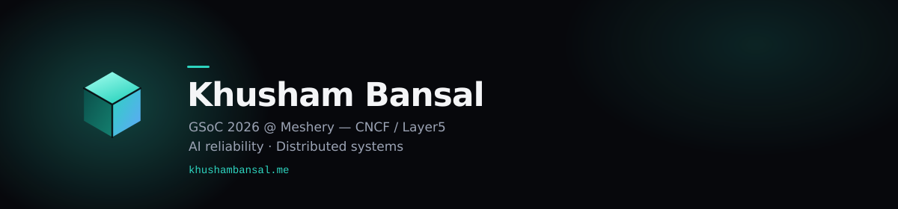
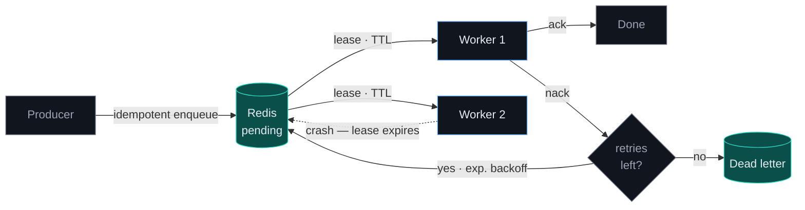
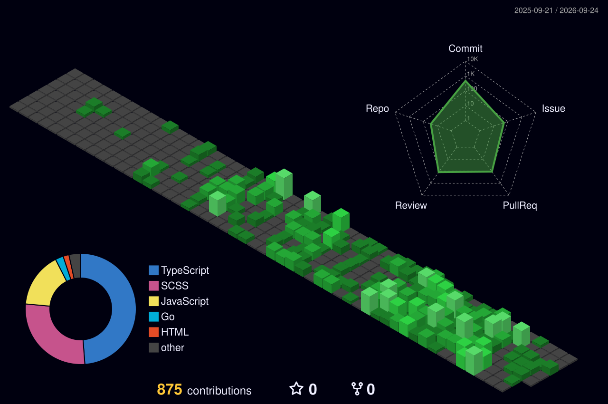

  <i>I build systems that fail well — retries, dead letters, and recovery paths, 
  whether the thing failing is a worker process or a language model.</i>

  
  
  
  

---

### Now

- **GSoC 2026** at **[Meshery](https://meshery.io/)** (CNCF / Layer5) — **70+ PRs authored, 130+ reviewed**
- **Research Intern**, AI Institute of South Carolina — grounding LLMs with knowledge graphs
- **B.E. Computer Engineering**, Thapar Institute — graduating 2027

### Built

| Project | | Stack |
| --- | --- | --- |
| **[relayq](https://github.com/KhushamBansal/relayq)** | Durable job queue — leased workers, backoff retries, dead-letter queue | `Go` `Redis` |
| **[Milepost](https://github.com/KhushamBansal/eld-trip-planner)** · [live](https://eld-trip-planner-seven-mocha.vercel.app) | HGV trip planner generating FMCSA daily logs under 70hr/8-day HOS rules | `Django` `React` `PostgreSQL` |
| **Ivo** · [demo](https://drive.google.com/file/d/16pp5bbNdyEUMzRb0Fj0CA-vsOgdfV82B/view?usp=sharing) | Local AI agent — LangGraph orchestration, SQLite + FTS5 RAG memory, MCP gateway | `LangGraph` `FastAPI` `MCP` |

### How relayq handles failure

2,000 jobs at **~5.4k jobs/s** · 200 concurrent idempotent requests collapsed to **1** · in-flight work recovered after a crash

### Tech

### Recognition

🥉 **3rd / 600+ teams**, Israeli-Indian Hackathon · 🎖️ **Reliance Foundation Scholar 2023** · 🏅 **Intl. Rank 97**, NSTSE 2022

  

