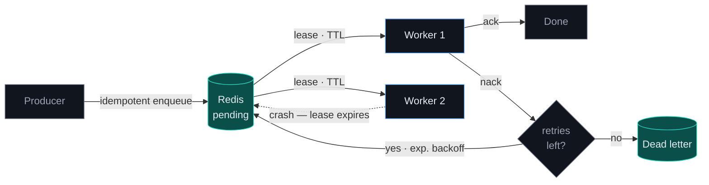

  <i>I build systems that fail well — retries, dead letters, and recovery paths, 
  whether the thing failing is a worker process or a language model.</i>

  
  
  
  

---

### What I'm doing now

- 🛠️ **GSoC 2026 Contributor** at **[Meshery](https://meshery.io/)** (CNCF / Layer5) — **70+ PRs authored, 130+ reviewed** across UI reliability, registry workflows, Sistent design-system integration, and Playwright E2E coverage.
- 🔬 **Research Intern** at **[AIISC](https://aiisc.ai/)** — grounding LLMs with knowledge graphs to reduce hallucinations, and designing evaluations for accuracy at scale.
- 🎓 **B.E. Computer Engineering** at Thapar Institute — CGPA **8.92/10**, graduating **2027**.
- 🌍 Working with teams across **India and the US** — enough timezone math that I now think in UTC.

### Things I've built

| Project | What it does | Stack |
| --- | --- | --- |
| **[relayq](https://github.com/KhushamBansal/relayq)** | Durable job queue with leased workers, exponential-backoff retries, a dead-letter queue, and idempotent enqueue. Drains **2,000 jobs at ~5.4k jobs/s**; recovers in-flight work after a worker crash. | `Go` `Redis` |
| **[Milepost](https://github.com/KhushamBansal/eld-trip-planner)** · [live](https://eld-trip-planner-seven-mocha.vercel.app) | Plans property-carrying HGV trips and generates FMCSA driver daily logs under the 70hr/8-day HOS ruleset — routing, required stops, one log sheet per calendar day. | `Django` `DRF` `React` `TypeScript` `PostgreSQL` |
| **Ivo** · [demo](https://drive.google.com/file/d/16pp5bbNdyEUMzRb0Fj0CA-vsOgdfV82B/view?usp=sharing) | Local AI agent with LangGraph orchestration (plan → tool calls → results) and SQLite + FTS5 RAG memory spanning semantic, episodic, and procedural recall. MCP gateway with human-in-the-loop approval on high-risk sends. | `LangGraph` `FastAPI` `React` `MCP` |

### How relayq works

The through-line in most of what I build is failure handling. Here's the queue,
in one picture — leases so crashed workers don't lose jobs, backoff so retries
don't stampede, and a dead-letter queue so nothing disappears silently.

**2,000 jobs drained at ~5.4k jobs/s** with 4 workers · 200 concurrent
idempotent requests collapsed to **1** job · in-flight work recovered after a
worker crash. → **[github.com/KhushamBansal/relayq](https://github.com/KhushamBansal/relayq)**

### Tech

### Recognition

- 🥉 **3rd Prize**, Israeli-Indian Hackathon — out of **600+ teams**
- 🎖️ **Reliance Foundation Scholar 2023** — $2,300 merit scholarship
- 🏅 **International Rank 97**, NSTSE 2022
- 📋 Shortlisted, **Smart India Hackathon** 2023 & 2024

  

  More at <a href="https://khushambansal.me">khushambansal.me</a>

